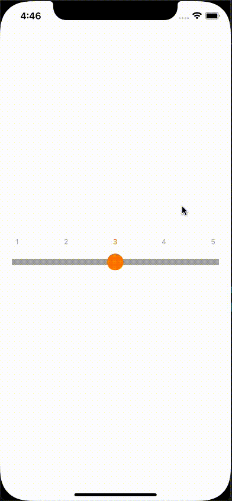

# ScaleSlider

This project is a sliding bar control with scale, it will have adsorption effect when sliding between scales to improve user experience, it supports taping the scale to slide directly to the corresponding position. Since it is just a toy project, it doesn't provide much abstraction. If you need to customize the views, you can copy the code to your project, modify the `IndexView` class and customize your own layout, similarly, the view part of `ScaleSlider` can be customized according to your needs.

